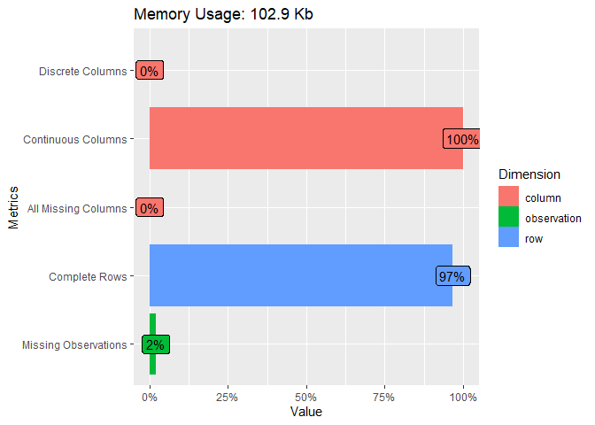
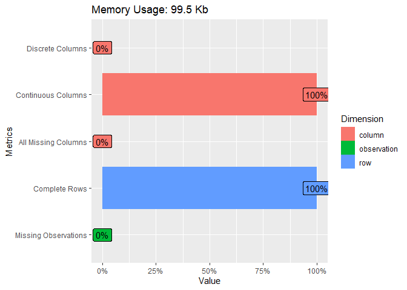

Risques extrêmes et application à la mesure du risque de marché
================
Pierre Clauss
Mars 2020

*Ce document R Markdown a pour objet la résolution des exercices 1.1 et
2.1 du cours.*

## Préambule

Je précise en préambule les 3 étapes nécessaires pour la réussite d’un
projet de data science :

1.  données : (i) importation, (ii) wrangling et (iii) visualisation (ou
    appelée encore *analyse exploratoire des données*)
2.  modélisation
3.  communication des résultats

L’univers du package **tidyverse** est essentiel pour réaliser ces 3
étapes avec R aujourd’hui.

``` r
library(tidyverse)
```

## 1 Données

### 1.1 Importation

Pour les 2 exercices, les données sont les mêmes. J’importe ces données
à l’aide du package **readxl**, qui gère les fichiers Excel
parfaitement (décimales, pourcentages, valeurs manquantes), avec la
fonction `read_xlsx()`.

``` r
library(readxl)
(renta <- read_xlsx(
  "data.xlsx",
  sheet = "VaR",
  skip = 4,
  col_names = c("Date", "France", "BRIC", "US_Corporate_Bonds")
))
```

    ## # A tibble: 4,306 x 4
    ##    Date                   France     BRIC US_Corporate_Bonds
    ##    <dttm>                  <dbl>    <dbl>              <dbl>
    ##  1 2003-10-01 00:00:00  0.0238    0.0164            0.000210
    ##  2 2003-10-02 00:00:00 -0.00182   0.0168           -0.00342 
    ##  3 2003-10-03 00:00:00  0.0257    0.0159           -0.0102  
    ##  4 2003-10-06 00:00:00 -0.000820  0.0150            0.00352 
    ##  5 2003-10-07 00:00:00  0.000733  0.0135           -0.00471 
    ##  6 2003-10-08 00:00:00  0.00262   0.0197            0.000419
    ##  7 2003-10-09 00:00:00  0.0161    0.00885          -0.00213 
    ##  8 2003-10-10 00:00:00  0.000565 -0.00139           0.00297 
    ##  9 2003-10-13 00:00:00  0.00356   0.0111            0.000496
    ## 10 2003-10-14 00:00:00 -0.00218  -0.00183          -0.00471 
    ## # ... with 4,296 more rows

Les données sont issues de Quandl. Vous pouvez remarquer dans la cellule
B4 du fichier Excel la fonction Quandl qui permet d’importer les données
*=QSERIES(Index\_1 : Index\_3 ; Start\_date : End\_date ; “daily” ;
“asc” ; “rdiff”)*.

Les données sont un échantillon de rentabilités quotidiennes de deux
indices actions du Nasdaq (France et BRIC) et d’un indice Merrill Lynch
obligataire d’entreprises US. L’échantillon commence le 1er octobre 2003
et se termine à la date du premier cours.

### 1.2 Démêlage (wrangling en anglais)

“Tidying and transforming are called *wrangling*, because getting your
data in a form that’s natural to work with often feels like a fight”
[**R for Data Science**](https://r4ds.had.co.nz/introduction.html)
(Grolemund G. and Wickham H.).

Je peux à l’aide du package **DataExplorer** obtenir un résumé des
données et évaluer si je peux les considérer comme **tidy**. Je vais
devoir enlever les valeurs manquantes.

``` r
library(DataExplorer)
renta <- renta %>% select(-"Date")
plot_intro(renta)
```

<!-- -->

``` r
(renta <- renta %>% drop_na())
```

    ## # A tibble: 4,164 x 3
    ##       France     BRIC US_Corporate_Bonds
    ##        <dbl>    <dbl>              <dbl>
    ##  1  0.0238    0.0164            0.000210
    ##  2 -0.00182   0.0168           -0.00342 
    ##  3  0.0257    0.0159           -0.0102  
    ##  4 -0.000820  0.0150            0.00352 
    ##  5  0.000733  0.0135           -0.00471 
    ##  6  0.00262   0.0197            0.000419
    ##  7  0.0161    0.00885          -0.00213 
    ##  8  0.000565 -0.00139           0.00297 
    ##  9  0.00356   0.0111            0.000496
    ## 10 -0.00218  -0.00183          -0.00471 
    ## # ... with 4,154 more rows

``` r
plot_intro(renta)
```

<!-- -->

### 1.3 Visualisation

Les statistiques de base sont résumées par le tableau et les graphiques
ci-dessous. Nous pouvons observer un fait stylisé très important des
rentabilités d’indices de marché, à savoir la leptokurticité de leur
densité.

``` r
summary(renta)
```

    ##      France                BRIC            US_Corporate_Bonds  
    ##  Min.   :-0.1073044   Min.   :-0.1226388   Min.   :-0.0227916  
    ##  1st Qu.:-0.0060996   1st Qu.:-0.0057058   1st Qu.:-0.0014747  
    ##  Median : 0.0006509   Median : 0.0010376   Median : 0.0003190  
    ##  Mean   : 0.0004081   Mean   : 0.0005547   Mean   : 0.0002004  
    ##  3rd Qu.: 0.0074609   3rd Qu.: 0.0075021   3rd Qu.: 0.0019529  
    ##  Max.   : 0.1236734   Max.   : 0.1449443   Max.   : 0.0198546

``` r
plot_density(renta)
```

<!-- -->

``` r
plot_qq(renta)
```

<!-- -->

## 2 Modélisation

Les VaR sont soit non-paramétriques (historique et bootstrap) soit
paramétriques (Gaussienne, Skew Student, GEV et GPD).

Rappel : la VaR est égale à
") avec 
la fonction de répartition (non-paramétrique ou paramétrique) des
rentabilités étudiées.

### 2.1 Résolution de *l’exercice 1.1* du cours

Voici ci-dessous les VaR demandées dans *l’exercice 1.1* pour les 3
indices avec .

  - **France**:
    
    | Historique | Bootstrap | Gaussienne | Skew\_Student |
    | :--------: | :-------: | :--------: | :-----------: |
    |  \-4.24%   |  \-4.26%  |  \-3.34%   |    \-4.25%    |
    

  - **BRIC**:
    
    | Historique | Bootstrap | Gaussienne | Skew\_Student |
    | :--------: | :-------: | :--------: | :-----------: |
    |  \-3.86%   |  \-3.87%  |  \-3.16%   |    \-4.02%    |
    

  - **US\_Corporate\_Bonds**:
    
    | Historique | Bootstrap | Gaussienne | Skew\_Student |
    | :--------: | :-------: | :--------: | :-----------: |
    |  \-0.78%   |  \-0.78%  |  \-0.67%   |    \-0.79%    |
    

<!-- end of list -->

Voici ci-dessous les VaR demandées dans *l’exercice 1.1* pour les 3
indices avec .

  - **France**:
    
    | Historique | Bootstrap | Gaussienne | Skew\_Student |
    | :--------: | :-------: | :--------: | :-----------: |
    |  \-7.04%   |  \-7.51%  |  \-4.45%   |    \-9.78%    |
    

  - **BRIC**:
    
    | Historique | Bootstrap | Gaussienne | Skew\_Student |
    | :--------: | :-------: | :--------: | :-----------: |
    |  \-8.62%   |  \-8.32%  |  \-4.22%   |    \-8.90%    |
    

  - **US\_Corporate\_Bonds**:
    
    | Historique | Bootstrap | Gaussienne | Skew\_Student |
    | :--------: | :-------: | :--------: | :-----------: |
    |  \-1.35%   |  \-1.37%  |  \-0.90%   |    \-1.39%    |
    

<!-- end of list -->

### 2.2 Résolution de *l’exercice 2.1* du cours

Pour définir la VaR GPD, il est nécessaire de déterminer le seuil à
partir duquel il est raisonnable de penser que les extrêmes suivent une
loi GPD. Cela se fait grâce au mean-excess plot : le seuil optimal est
la valeur à partir de laquelle la tendance est croissante.

<!-- --><!-- --><!-- -->

Voici ci-dessous les VaR TVE demandées dans *l’exercice 2.1* pour les 3
indices avec .

  - **France**:
    
    |   GEV   |   GPD   |
    | :-----: | :-----: |
    | \-3.17% | \-4.28% |
    

  - **BRIC**:
    
    |   GEV   |   GPD   |
    | :-----: | :-----: |
    | \-3.03% | \-3.91% |
    

  - **US\_Corporate\_Bonds**:
    
    |   GEV   |   GPD   |
    | :-----: | :-----: |
    | \-0.69% | \-0.78% |
    

<!-- end of list -->

Voici ci-dessous les VaR TVE demandées dans *l’exercice 2.1* pour les 3
indices avec .

  - **France**:
    
    |   GEV   |   GPD   |
    | :-----: | :-----: |
    | \-6.97% | \-7.59% |
    

  - **BRIC**:
    
    |   GEV   |   GPD   |
    | :-----: | :-----: |
    | \-6.76% | \-8.39% |
    

  - **US\_Corporate\_Bonds**:
    
    |   GEV   |   GPD   |
    | :-----: | :-----: |
    | \-1.25% | \-1.39% |
    

<!-- end of list -->
